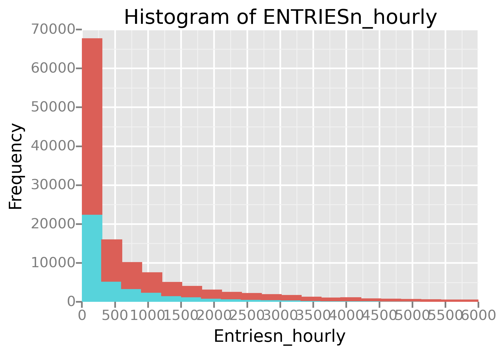
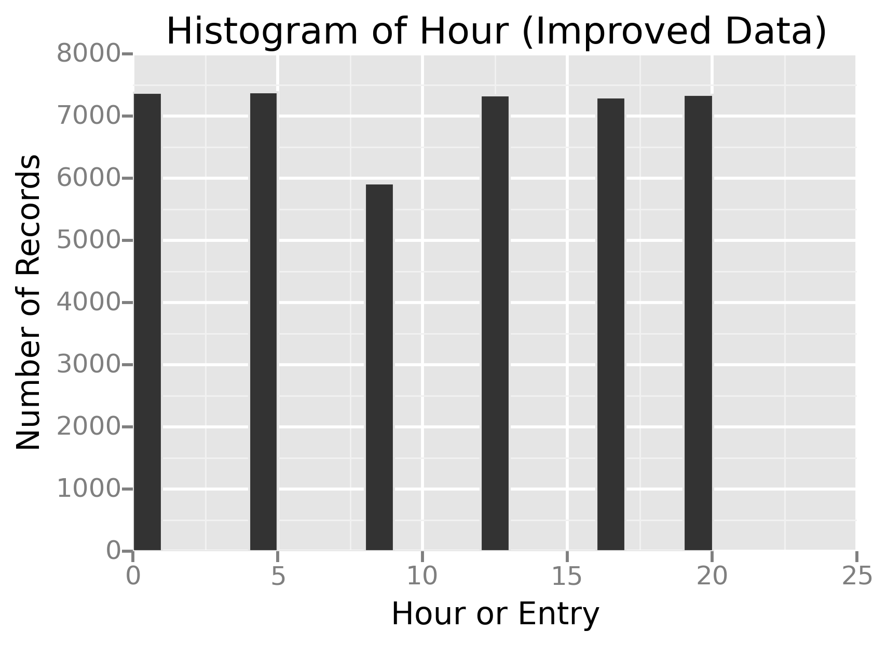

### Introduction ###

Today we investigate the relation between weather and subway ridership
in New York City in May 2011. All data and code is available for
download from the git repository [\[gitRepo\]][&gitRepo].

### Wrangling the Data ###

The subway data is a sample of the MTA New York City Subway dataset
that includes hourly entries and exits at the turnstiles of different
subway stations. Multiple .csv files contating this data can be
downloaded from the Metropolitan Transportation Authority (New York)
web site; a link to one such MTA turnstile file can be seen at
the URL [\[mta050711\]][&mta050711]. These files contain 8 set of
entries per row, where each set gives the cumulative number of entries
and exits at different times.

The following code separates the entries into individual rows:

```python
for inName in filenames:
    infilename = dataset_path+inName
    with open(infilename, 'rb') as inFile:
        outfilename = "updated_"+inName
        with open(outfilename, 'wb') as outFile:
            csvReader = csv.reader(inFile, delimiter=',')
            csvWriter = csv.writer(outFile, delimiter=',')
            for row in csvReader:
                for idx in range(8):
                    newRow = row[0:3] + row[3+5*idx:8+5*idx]
                    csvWriter.writerow(newRow)
            outFile.close()
        inFile.close()

```

All the individually updated files are then consolidated into a master
file with a column headers:
'C/A,UNIT,SCP,DATEn,TIMEn,DESCn,ENTRIESn,EXITSn'. This master file is
then loaded into a pandas data frame and filtered to retain only the regular
turnstiles.

```python
turnstile_df = pandas.read_csv(filename)
turnstile_df = turnstile_df[turnstile_df.DESCn == 'REGULAR']
```

For each unique turnstile, we used the following code to compute hourly entry and exit numbers from cumulative entry and exit numbers.

```python
# Cumulative to hourly
def get_hourly_entries(df):
    hourlyEntries = df.ENTRIESn - df.ENTRIESn.shift(1) 
    df['ENTRIESn_hourly'] = hourlyEntries.fillna(1)
    return df
turnstile_df = turnstile_df.groupby(['C/A','UNIT','SCP']).apply(
			       get_hourly_entries)

# Convert time to hour
def time_to_hour(time):
    dt = pandas.to_datetime(time, dayfirst=True)
    hour = dt.hour
    return hour
turnstile_df['Hour'] = turnstile_df['TIMEn'].map(time_to_hour)

# Reformat dates
def reformat_subway_dates(date):
    dt = datetime.datetime.strptime(date, "%m-%d-%y")
    date_formatted = dt.strftime("%Y-%m-%d")
    return date_formatted
turnstile_df['DATEn'] = turnstile_df['DATEn'].map(reformat_subway_dates)

turnstile_df.to_csv(final_data_filename)
```

The weather data, downloaded from [\[weatherData\]][&weatherData],
includes information regarding temperature, daily precipitation,
barometric pressure, and wind speed, etc.

The subway data and the weather data are then joined together into a
master dataset. A merged dataset is included in the repository.

Finally the following code was used to tweak the master data to raname
some columns, is also necessary. This includes creating 3 new columns:
date time, day of the week, and weekday/weekend.

```python
# Disable false warnings from potetial chained assignment
pandas.options.mode.chained_assignment = None

# add new column datetime
turnstile_weather['datetime'] = turnstile_weather['DATEn'] + ' ' + turnstile_weather['TIMEn']

# rename column 'Hour' to 'hour'
turnstile_weather.rename(columns = {'Hour':'hour'}, inplace=True)
#turnstile_df['hour'] = turnstile_df['TIMEn'].map(lambda x: pandas.to_datetime(x, dayfirst=True).hour)

# add new columns day_week,weekday
turnstile_weather['day_week'] = turnstile_weather['datetime'].map(lambda x: pandas.to_datetime(x, dayfirst=True).weekday())
turnstile_weather['weekday'] = turnstile_weather['day_week'].map(lambda x: 1 if x < 5 else 0)

#pandasql does not deal well with strangely named columns
turnstile_weather = turnstile_weather.rename(columns={'Unnamed: 0':'Idx_audit'})
```

### Exploratory Data Analysis ###

The following code produces two histograms of hourly entries in rainy days are non-rainy days 

```python
# plot a historgram for hourly entries when it is raining and not
# raining - use ggplot
from ggplot import *
imagename = "entries_hist.png" 
plot = ggplot(aes(x='ENTRIESn_hourly', fill='rain', color='rain',
                  legend=True), data=turnstile_weather) +\
    geom_histogram(binwidth=300) +\
    xlim(low=0, high=6000) +\
    ggtitle('Histogram of ENTRIESn_hourly') +\
    xlab('Entriesn_hourly') +\
    ylab('Frequency')
ggsave(imagename, plot, path='plots', width=6, height=4,
       bbox_inches='tight')
```
>

The x-axis has been truncated at 6000 to leave out outliers in the
long tail. There are a lot more samples with no rain than with rain. We
suspect that more people enter and ride subways on rainy days. However, establishing this hypothesis requirer a statistical significance
test. Note that the neither of the rainy or non-rainy samples are
normally distributed. Therefore the commonly used Welch’s T test does
not apply here.

Next we create a plot to show the stations that are the busiest hour
by hour. Stations with most riders entering are shown in red, and
stations with most riders exiting are shown in blue. The size of the
dots are scaled according to the number of riders, so that we can
compare how the maximum number of entries and exists vary throughout
the day.

While the x-asis shows the hour of the day, the y-axis shows the
latitude of the stations. This gives a positional feel to the
stations by showing how far toward north or south they are
with respect to each other. One can see that most people travel
from south to north in the morning and afternoon, while most people
travel from north to south in the evening.


The plot was created with the following code. 

```python
df = turnstile_weather[['UNIT', 'latitude', 'longitude', 'ENTRIESn_hourly']]
df_sum = df.groupby(['UNIT'], as_index=False)['ENTRIESn_hourly'].aggregate(np.sum)
df = df.groupby(['UNIT'], as_index=False).aggregate(np.max)
df.ENTRIESn_hourly = df_sum.ENTRIESn_hourly
station_plot = ggplot(aes(x='longitude', y='latitude',
                          size='ENTRIESn_hourly',
                          saturation='ENTRIESn_hourly'), data=df) +\
    geom_point() +\
    ggtitle("MTA Entries By Station") + xlab('Station') + ylab('Entries')
```


### Statistical Inference ###

Now that we have observed evidence in the sample data set that
ridership in rainy days is larger than that in the non-rainy days, we are
ready to perform a statistical test and to report the confidence level
in the evidence.

The histograms of hourly ridership in rainy and non-rainy days show
that the data is not normally distributed. Hence a parametric test is not
appropriate on such data. So we used a non-parametric test called
Mann Whitney U test [\[udacityMH\]][&udacityMH] . Additionally we
chose a confidence interval of 95%; i.e. we reject the null hypothesis
if the p-value is less than 0.05.

Instead of comparing the unknown distributions, Mann-Whitney U test tests
if we draw randomly from each population, whether one draw is likely
to generate a higher value than the other. Stated mathematically,
given a random draw x from population X of hourly ridership in rainy
days, and a random draw y from population Y of hourly ridership in
non-rainy days we formulate the two-tailed hypotheses as follows:

* The alternative hypothesis states: each hourly ridership in rainy
  days is more likely to be differnt than each houry ridersip in
  non-rainy days; i.e.

<center>H<sub>1</sub>: P (x > y) \neq 0.5</center>

* The corresponding null hypothesis states: each hourly ridership in
  rainy days has equal chance of being greater or smaller than each
  houry ridersip in non-rainy days; i.e.

<center>H<sub>0</sub>: P (x > y) = 0.5</center>

According to the null hypothesis, the observed differences in sample
mean response times during rainy and non-rainy days are the result of
pure chance, and cannot be generalized to the entire population.

Here we apply statistical inference to generalize the effect observed
in the samples to the entire population, because data were randomly
sampled from a large population.

In particular, we want to establish that the difference between mean
hourly ridership in rainy and non-rainy days is greater than 0. We do
so by rejecting the null hypothesis: the observed differences in mean
hourly ridership of the samples in rainy and non-rainy days are the
result of pure chance, and cannot be generalized to the entire
population.

The histograms of hourly ridership on rainy and non-rainy days show
that the data is not normally distributed. So t-test is not
appropriate on such data, and we used a non-parametric test such as
Mann Whitney U test [\[udacityMH\]][&udacityMH] . Additionally we
chose a confidence interval of 95%; i.e. we reject the null hypothesis
if the p-value is less than 0.05.

We use the Python package scipy.stats.mannwhitneyu
[\[scipyMH\]][&scipyMH] to compute the t and p-values. Data under
incongruent and congruent conditions are used as sample 1 and sample 2
respectively.

```python
# Compute Mann Whitney U test (two samples one-tailed test with 95%
# confidence interval). You would reject the null hypothesis of a 
# greater-than test when p/2 < alpha and t > 0, and of a less-than 
# test when p/2 < alpha and t < 0.
with_rain = turnstile_weather[turnstile_weather.rain == 1]['ENTRIESn_hourly']
without_rain = turnstile_weather[turnstile_weather.rain == 0]['ENTRIESn_hourly']
print "rainy day mean    = ", np.mean(with_rain)
print "non-rainy day mean = ", np.mean(without_rain)
U, p = scipy.stats.mannwhitneyu(with_rain, without_rain)
print "Mann Whitney U = ", U
print "one-tailed p-value: P > U = ", p
```

The test results are listed below. Note that while our alternative
hypothesis is two-tailed, the python package only returns a one-tailed
p-value; see next paragraph on how to post-process the results:

```
rainy day mean    =  1105.4464
non-rainy day mean =  1090.2788
Mann Whitney U = 8.02071
one-tailed p-value: P > U =  0.02499
```

Since the U distribution is symmetric, the two-tailed p-value for the
alternative hypothesis, P > |U|, is twice the one tailed p-value
computed above [\[tailTests\]][&tailTests] [\[tailed2\][&tailed2] [\[paired\]][&paired].

```python
alpha = 0.5   # significance level
# one-tailed test, two-tailed hypothesis
if (2*p) < alpha:
    print "Reject null hypotheis because P > |U| = {0} < {1}".format(2*p, alpha)
else:
    print "Cannot reject null hypotheis becuase P > |U| = {0} >= {1}".format(2*p, alpha)
```

This derived two-tailed p-value, 4.99%, is less than the alpha value
of 0.05. Therefore, the null hypothesis can be rejected in favor of
the alternaitve hypothesis, as shown in the output below:

```
Reject null hypotheis because P > |U| = 0.000548213914249 < 0.5%
```

The Mann-Whitney U test produces a one-tail p-value of
0.02499. Although the observed mean ridership on rainy days is larger
than that on non-rainy days, we use a two-tailed test to account for
the cases where ridership on rainy days can either be higher or lower
than that on non-rainy days. The one-tail p-value can be doubled to
get a two-tail p-value of 4.99% [\[tailTests\][&tailTests] [\[tailed2\][&tailed2]. This implies a 4.99% chance of
seeing a U value as extreme as in our test, if the subway ridership
was the same on rainy and non-rainy days. In other words, for a
p-critical value of 5%, there is a statistically significant
difference between the hourly number of riders on rainy and non-rainy
days.

### Linear Regression ###

We use the following techniques to compute the coefficients theta and
produce prediction for ENTR	IESn_hourly in your regression model:

* Gradient descent (as implemented in exercise 3.5)
* OLS using Statsmodels [\[olsWiki\]][&olsWiki] 

Models are created using both Gradient descent and Ordinary Least
Squares using statsmodesl [\[olsStats\]][&olsStats]. Although R2
values obtained from both models are similar, the residual mean from
the OLS predictions is 0.01 which closer to 0 than the residual mean
of 0.69 from gradient descent predictions.

We started with a small set of features and then gradually expanded
the set to improve the performance of the model. We started with a
minimal set of feature variables, hour (int64), rain (0-1), fog (0-1),
and a variable for turnstile unit. Later we added another 0-1 variable
called 'weekday' that indicates whether it is a working day or a
weekend. We used the following code to determine this variable

```python
turnstile_weather['day_week'] = turnstile_weather['datetime'].
    map(lambda x: pandas.to_datetime(x, dayfirst=True).weekday())
turnstile_weather['weekday'] =
    turnstile_weather['day_week'].map(lambda x: 1 if x < 5 else 0)
```

Since the tunstile unit is described by non-numerical values, we
had to convert them into 466 different 0-1 dummy variables before
using them in a regresssion model using the following code

```python
dummy_units = pandas.get_dummies(df['UNIT'], prefix='unit')
features = features.join(dummy_units)
```

Why did you select these features in your model? We are looking for
specific rea sons that lead you to believe that the selected features
will contribute to the predictive power of your model.

Your reasons might be based on intuition. For example, response for
fog might be: “I decided to use fog because I thought that when it is
very foggy outside people might decide to use the subway more often.”

Your reasons might also be based on data exploration and
experimentation, for example: “I used feature X because as soon as I
included it in my model, it drastically improved my R2 value.”

The feature variables used in the regression are explained below

* For predicting hourly entries, hour should be a feature variable.
* The Mann-Whitney U test indicates rain increases average ridership,
  so rain is used as a feature variable.
* Common sense tells us ridership is impacted by fog, hence fog was
  included.
* Similarly, we believe a causal connection exists between ridership
  and 'weekday'.
* The dummy variables help us distinguish between low-volume and
  high-volume stations. Without them, each station is treated exactly
  the same. The dummy variables provide a different baseline
  (intercept) for each station, upon which the other features act as
  modifiers.

What are the coefficients (or weights) of the non-dummy features in
your linear regression model?

The coefficients of the non-dummy features obtained from both the
original and the improved data sets are given in the follwoing table
 
<table>
	<tr>
		<th>Variable</th>
		<th>Coefficient from Original Dataset</th>
		<th>Coefficient from Improved Dataset</th>
    </tr>
    <tr>
		<td>hour</td>
		<td>4.63609894e+02 </td>
		<td>8.58068182e+02</td>
	 </tr>
	 <tr>
		<td>rain</td>
		<td>-3.72191463e+01</td>
		<td>2.43552116e+01</td>
	 </tr>
	 <tr>
		<td>fog</th>
		<td>1.81279042e+01</td>
		<td>-5.87978269e+01</td>
	 </tr>
	 <tr>
		<td>weekday</td>
		<td>2.44304279e+02</td>
		<td>4.39333366e+02</td>
	 </tr>
</table>

What is your model’s R2 (coefficients of determination) value?

When trained and tested on the original data, the Gradient descent
model has an R2 value of 0.468331243229 and the OLS model has an R2
value of 0.46830639288.

When trained and tested on the improved data, the Gradient descent
model has an R2 value of 0.481783237507 and the OLS model has an
R2 value of 0.481782387414.

<table>
	<tr>
		<th>Regression Method</th>
		<th>R2 on Original Dataset</th>
		<th>R2 on Improved Dataset</th>
	</tr>
	<tr>
		<td>Gradient Descent</td>
		<td>0.468331243229</td>
		<td>0.46830639288</td>
	</tr>
	<tr>
		<td>OLS</td>
		<td>0.481783237507</td>
		<td>0.481782387414</td>
	</tr>
</table>

What does this R2 value mean for the goodness of fit for your
regression model? Do you think this linear model to predict ridership
is appropriate for this dataset, given this R2 value?

The R2 value, alternatively called the coefficient of determination,
measures the models ability to account for the variability in the data
relative to a intercept-only model which merely predicts the mean. It
varies from 0 to 1 and bigger is better. Baseline model has an R2 of
0, and the perfect model has an R2 of 1.
	
The R2 value of our model is 0.493. In other words, it is able to
identify 49% of the variation in the training data. Although we cannot
evaluate a model only based on its R2 value, the R2 value of 49%
is a quite reasonable rule-of-thumb guidance. That said, R2 values of
time-series data can be tricky, and even a bad model can sometimgs
have a 90% R2 value [\[rnauRs\]][&rnauRs]

### Conclusion: Do People Ride the Subway More when it is Raining ? ###

Our analyses of the May 2011 data show that more people ride the
subway when it is raining.

Our exploratory data analyses indicated that more people might ride
the subway on rainy days. When we compare the density plots or hourly
entries on rainy and non-rainy days both on weekends and weekdays, we
see that the weekday density plot of rainy days (color blue) have
wider right tail.


>

The above plot was created with the following code. Note that the legends
do not work in the current version of ggplot.

```python
plot = ggplot(turnstile_weather, aes(x='ENTRIESn_hourly', color='rain')) + \
       geom_density() + \
       xlim(0, 3000) +\
       facet_wrap('weekday') +\
       labs(x='Entriesn_hourly', y='Count of Records')
```

According to the sample data set, average ridership on the NYC subway
increases from 1090 entries per hour on non-rainy days to 1105 entries
per hour on rainy days. As mentioned above, we we validated this
observation with a statistical test. The Mann-Whitney U test produces
a one-tail p-value of 0.02499, which leads to a two-tail p-value of
4.99%. In other words, for a p-critical value of 5%, there is a
statistically significant increase in the hourly number of riders on
rainy days compared to non-rainy days.

Next step is to predict the number of hourly entries linear regression
models. Unfortunately the Gradient Descent model produced a negative
co-efficient for the 'rain' variable which seems to imply that fewer
people ride the subway when it is rainig. This is the opposite of what
we expected. We suspect that the calculation of hourly entries in the
original dataset is not reliable (more on this in the 'Reflection'
section). The improved data set, on the other hand, counts the hourly
entries in a more consistent manner. When the regression model is
trained on the improved data, it produces a positive coefficient for
the 'rain' variable.

### Reflection on Shortcomings of Data and Analysis ###

#### Shortcomings of Data ####

We have used statistical techinques to analyse data and build
regression models. For these techniques to work, the dataset needs to
represent a random sample of the population. In this section we will
examine how "random" the sample really is.


The originial MTA data set contains time-series records of
cumulative number of entries and exits at each turnstile. From
		this data we calculated hourly entries and exits by taking the
		difference between the successive records. This is valid only
		if the time series data is colleced at fixed intervals in a
		periodic fashion. Unfortunately this is not the case, unit R003 only
		logs data every 4 hours starting from midnight. Another unit,
		R550, logs data many times every hour.

```python
unitName = 'R003'
date = '2011-05-01'
hours = df[(df.UNIT==unitName) & (df.DATEn==date)].TIMEn
print "Unit ", unitName, " has logged entries on ", date, " at hours:"
print hours.values
```

The following histogram clearly shows how the total number of
records vary from hour to hour. Due to this uneven number of
records per hour, our calculation of entries per hour is not
acccurate, and may lead to unreliable conclusions and predictions.

```python
rph_plot = ggplot(aes(x='hour'), data=df) +\
           geom_histogram() +\
		   ggtitle('Histogram of Hour') + \
		   xlab('Hour or Entry') + ylab('Number of Records')
```


This problem has been addressed in the improved data set
[\[combinedData\]][&combinedData].  Indeed, it contains an even number
of records for every 4-hour period.



#### Shortcomings of Analysis ####

Although the MTA data records entry and exit data for each station
several times a day, the weather data is recorded once a day. Thus on
a given day, we expect the hourly variations in ridership independent
of whether it is rainy or not.

Since the Mann-Whitney test confirmend our expectation that more
people ride the subway on rainy days, we expect the theta coefficient
of the 'rain' varaible to be positive in the regression
model. Although, this coefficient is negative in the model creative in
the model trained on the original data, it is positive in the improved
data. This confirms that the data should be adequately cleaned up
before using to to build predictive models.

A careful examination of the residuals can tell us if our choice of
the regression model is appropriate. Residuals are a form of error,
and basically we expect the errors to be normally and independently
distributed with a mean of 0 and some constant variance
[\[nistEstats\]][&nistEstats]. Here is a histogram of the residuals.


```python
# Test residuals for normal distribution
residuals = outcomes - predictions
(zscore, pvalue) = scipy.stats.normaltest(residuals)
legLabel = 'mean = {0}, pvalue = {1}'.format(residuals.mean(), pvalue)

# Plot a histogram of residuals
plt.figure()
residuals.hist(bins=20, label=legLabel)
plt.xlabel(prefix+" Residuals")
plt.ylabel("Frequency")
plt.legend(loc='upper center', bbox_to_anchor=(0.5, 1.05),
fancybox=True, shadow=True)
```

Although the histogram looks a good fit for Gaussian distribution
(symmetrical with peak in the middle), the normality test produces a
p-value of 0.0. In other words, the residuals deviate from a normal
distribution in a statistically significant manner
[\[normTest\]][&normTest]. This failure in the normality test needs
further investigation: we may either examine if this caused by a few
outliers, or swtich to non-parametric tests.

We could have worked a bit more to improve the performance of the
model by a combination of the following two approaches.
		
* Make the model more complex by either adding more features
or by using polynomial combinations of features. However, a complex model
 takes longer to train and to use.
 
* Make the data more complex and train the model with a larger data
set. However, processing a large data set often requires a distributed
processing framework such as MapReduce.

Note that these two approaches are complimentary. If the model is too
simple, it underfits the data (high bias) and its performance cannot
be improved by feeding more data. If the model is too complex, it
overfits the data (high variance), and its performance can be improved
by tuning it with more data. 

#### Shortcomings of Statistical Test ####

The conclusions drawn based on Mann-Whitney U test results can be made
stronger with additional descriptive statistics such as interquartile
range [\[udacityMH\]][&udacityMH].

### References

[\[gitRepo\] Analyze New York City Subway Ridership][&gitRepo]

[\[mta050711\] MTA Turnstile Data, May 2011] [&mta050711] 

[\[weatherData\] Underground Weather Data] [&weatherData]

[\[combinedData\] Combined MTA and underground weather data.] [&combinedData]

[\[scipyMH\] scipy.stats.mannwhitneyu] [&scipyMH]

[\[udacityMH\] Understanding the Mann-Whitney U Test] [&udacityMH]

[\[tailTests\] scipy.stats.mannwhitneyu] [&tailTests]

[\[tailed12\] One-tail vs. two-tail P values, GraphPad Software] [&tailed12]

[\[paired\] Unpaired and paired two-sample t-tests] [&paired]

[\[olsWiki\] Ordinary least squares, Wikipedia] [&olsWiki]

[\[olsStats\] Statsmodels regression OLS] [&olsStats]

[\[nistEstats\] NIST Engineering Statistics Handbook] [&nistEstats]

[\[normTest\] Interpreting results: Normality tests, GraphPad Software] [&normTest]

[\[rnauRs\] What's a good value for R-squared ?] [&rnauRs]


[&gitRepo]: https://github.com/samitchaudhuri/analyze-subway "Analyze New York City Subway Ridership"
[&mta050711]: http://web.mta.info/developers/data/nyct/turnstile/turnstile_110507.txt "MTA Turnstile Data, May 2011"
[&weatherData]: https://www.dropbox.com/s/7sf0yqc9ykpq3w8/weather_underground.csv "Underground Weather Data"
[&combinedData]: https://www.dropbox.com/s/meyki2wl9xfa7yk/turnstile_data_master_with_weather.csv "Combined MTA and underground weather data."
[&scipyMH]: http://docs.scipy.org/doc/scipy/reference/generated/scipy.stats.mannwhitneyu.html "sipy.stats.mannwhitneyu"
[&udacityMH]: https://storage.googleapis.com/supplemental_media/udacityu/649959144/MannWhitneyUTest.pdf "Understanding the Mann-Whitney U Test"
[&tailTests]: http://www.ats.ucla.edu/stat/mult_pkg/faq/general/tail_tests.htm "What are the differences between one-tailed and two-tailed tests ?"
[&tailed12]: http://graphpad.com/guides/prism/6/statistics/index.htm?one-tail_vs__two-tail_p_values.htm "One-tail vs. two-tail P values, GraphPad Software"
[&paired]: https://en.wikipedia.org/wiki/Student%27s_t-test#Unpaired_and_paired_two-sample_t-tests "Unpaired and paired two-sample t-tests"
[&nistEstats]: http://www.itl.nist.gov/div898/handbook/pri/section2/pri24.htm "Are the model residuals well behaved?, NIST Engineering Statistics Handbook"
[&normTest]: http://www.graphpad.com/guides/prism/6/statistics/index.htm?stat_interpreting_results_normality.htm "Interpreting results: Normality tests, GraphPad Software"
[&olsWiki]: http://en.wikipedia.org/wiki/Ordinary_least_squares "Ordinary least squares, Wikipedia"
[&olsStats]: http://statsmodels.sourceforge.net/devel/generated/statsmodels.regression.linear_model.OLS.html "Statsmodels regression OLS"
[&rnauRs]: http://people.duke.edu/~rnau/rsquared.htm#punchline "What's a good value for R-squared ?"


